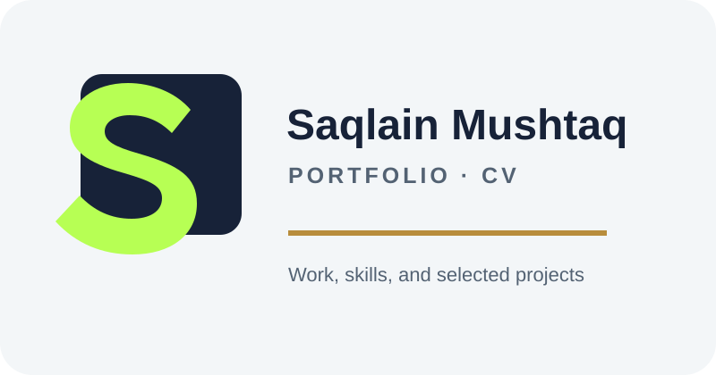

<div align="center">
  
  <h1>Saqlain Mushtaq</h1>
  <p><strong>Full-stack web developer · web app builder · mobile app developer</strong></p>
  <p>
    <a href="https://github.com/raosaqlainking">GitHub</a> ·
    <a href="https://saqlain-mushtaq-portfolio.vercel.app/">Portfolio & CV</a> ·
    <a href="https://zalim-marketing.vercel.app/">Zalim-Marketing</a> ·
    <a href="https://zalim-store.vercel.app/">Zalim Store</a>
  </p>
</div>

## Hi, I’m Saqlain

I build professional websites, online stores, web apps, and mobile applications for businesses, professionals, teams, and personal projects. I focus on clean design, fast loading, responsive layouts, useful features, and SEO foundations that help a site get found. I also keep the structure clear for future content, analytics, and ad-network review. AI helps me work faster, but I check the layout, copy, details, and final result myself.

```text
$ whoami
Saqlain Mushtaq — full-stack web and app developer

$ build
websites · stores · web apps · mobile apps

$ approach
clear brief, solid build, careful review, useful result

$ location
Pakistan
```

## What I offer

### Websites and online stores

Business websites, portfolios, landing pages, WordPress builds, and eCommerce stores with clear content, strong user flows, responsive layouts, and practical management features.

### Web and mobile applications

Useful web applications and mobile experiences for work, learning, business ideas, hobbies, and personal projects. I can take an idea from a rough brief to a working interface and a clear user journey.

### SEO-ready foundations

Responsive structure, readable content, performance basics, useful metadata, accessible layouts, and clean technical foundations for search visibility and future ad-network review. Approval always depends on the platform’s own policies and review process.

## Selected work

<table>
  <tr>
    <td width="33%" valign="top">
      
      <h3><a href="https://zalim-marketing.vercel.app/">Zalim-Marketing</a></h3>
      <p>Business portfolio for marketing, web work, SEO, and client enquiries.</p>
      <p><a href="https://zalim-marketing.vercel.app/">Open project ↗</a></p>
    </td>
    <td width="33%" valign="top">
      
      <h3><a href="https://zalim-store.vercel.app/">Zalim Store</a></h3>
      <p>Automotive eCommerce demo and portfolio project with product browsing and checkout flows.</p>
      <p><a href="https://zalim-store.vercel.app/">Open project ↗</a></p>
    </td>
    <td width="33%" valign="top">
      
      <h3><a href="https://saqlain-mushtaq-portfolio.vercel.app/">Portfolio & CV</a></h3>
      <p>Personal portfolio covering education, skills, links, and selected work.</p>
      <p><a href="https://saqlain-mushtaq-portfolio.vercel.app/">Open project ↗</a></p>
    </td>
  </tr>
</table>

## Skills I use

### Frontend

      

### Backend and data

        

### Mobile and product work

`React Native` · `Expo` · `Web apps` · `Mobile applications` · `eCommerce` · `WordPress` · `Responsive UI` · `UX flows` · `Testing` · `Accessibility` · `SEO` · `Digital marketing` · `AI workflows`

### Additional languages

`C++` · `Rust` · `Go` · `Python` · `.NET Core` · `SQL`

## Outside the build

I’m also a dedicated gamer and a long-time competitive player. Gaming keeps me curious about interaction, feedback, pacing, and the small details that make a digital experience feel good.

## GitHub activity

<div align="center">
  
  
</div>

<div align="center">
  
</div>

## Find me online

<p>
  <a href="https://github.com/raosaqlainking"></a>
  <a href="https://www.instagram.com/zalimmarketing"></a>
  <a href="https://www.facebook.com/profile.php?id=61564416062631"></a>
  <a href="https://discord.com/invite/RhfqQ2YG"></a>
  <a href="mailto:raosaqlaingee@gmail.com"></a>
</p>

> Thanks for stopping by. If you have a useful idea, send it over.

<sub>Upload the animated portrait and the three project marks to the repository’s <code>assets</code> folder before committing this README.</sub>
